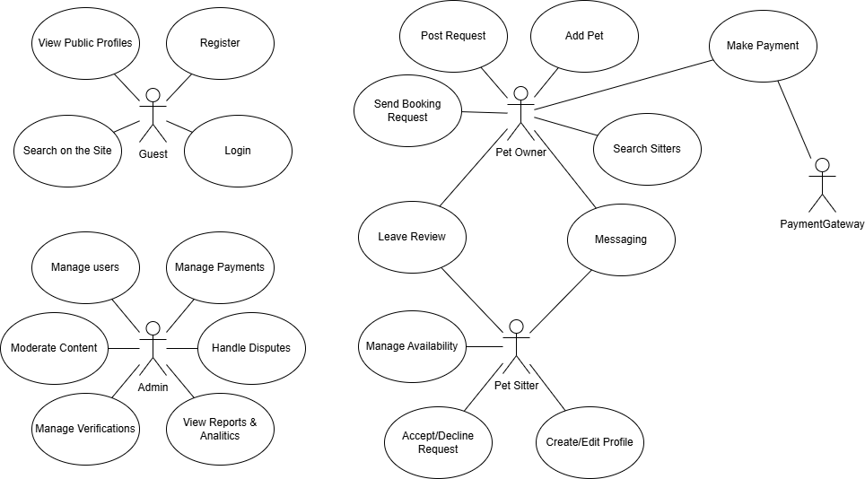
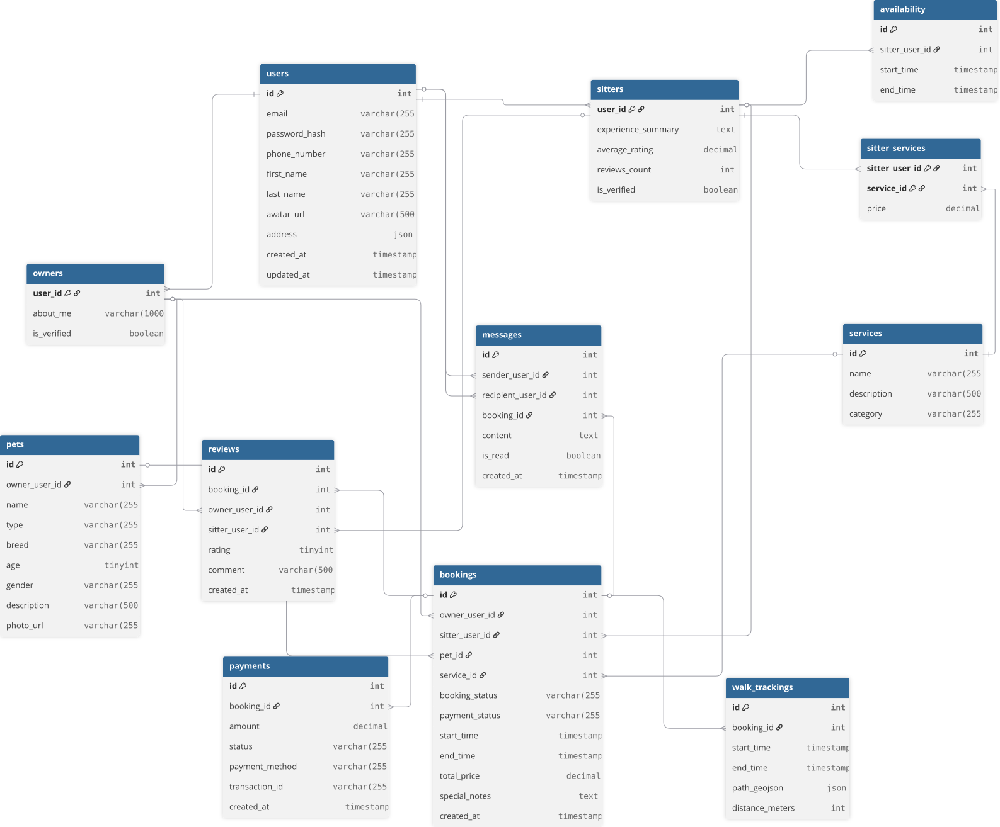

# Описание проекта


Проект «Barsik» – веб-сервис для поиска, заказа и управления услугами pet-sitter’ов: выгул, присмотр, передержка, домашние визиты и дополнительные сервисы (груминг, вакцинация и т. п.). Платформа объединяет владельцев животных и проверенных исполнителей, обеспечивает безопасное бронирование и оплату, простой обмен сообщениями.

Ключевые возможности: профили и портфолио pet-sitter’ов; фильтрация и поиск по локации, типу животного, услуге и рейтингу; мгновенное бронирование и предварительная бронь; система отзывов и рейтингов; безопасные платежи и расчеты через платформу; трекинг прогулок и отчеты; расписание и календарь; встроенный чат.

## Основные функции


- **создание и изменение профиля и портфолио**
- **поиск специалистов с применением фильтров**
- **бронирование специалистов**
- **оплата услуг**
- **система отзывов**
- **встроенный чат**


## Стек используемых технологий

- Java Spring Boot
- Spring Data
- Sping Security
- PostgreSQL

## Роли пользователей
- **Неавторизованный пользователь**: 
   Может просматривать публичные профили и объявления, посмотреть информацию о сервисе.
- **Владелец питомца**: 
   Регистрируется, создает профиль питомца, публикует запросы, выбирает и бронирует ситтера, оплачивает услуги, оставляет отзывы.
- **Пет-ситтер**: 
   Регистрируется, создает профиль и портфолио, указывает доступность, отвечает на запросы, принимает бронирования, получает оплату.
- **Администратор**: 
   Управляет пользователями, модерацией контента, просматривает транзакции, решает спорные вопросы.


## Сценарии



## Схема БД



## API: Endpoint Overview


### 1. Аутентификация и управление профилем


- `POST /auth/register`  
   - **Описание**: Регистрация нового пользователя. В теле запроса передается `role` ('owner' или 'sitter'), на основе которого создается запись в соответствующей таблице (`owners` или `sitters`).
   -  Request Body
       - ```json
         
           {
              "email": "user@example.com",
              "password": "securepassword123",
              "phoneNumber": "+1987654321",
              "firstName": "grzegorz",
              "lastName": "bily",
              "role": "OWNER"
           }
      - Response: Status 201 on successful registration.   
- `POST /auth/login`  
   - **Описание**: Аутентификация пользователя по email и паролю. Возвращает JWT токен для последующих запросов.
   - Request Body
       - ```json
        
            {
              "email": "user@example.com",
              "password": "password123"
            }
         ```
         При успещной аутентификации добавление в Http-Onle Cookie JWT

-  `GET /api/auth/logout`

- `GET /api/profile`
  ```json
     {
        "email": "user@example.com",
        "firstName": "Иван",
        "lastName": "Петров",
        "phoneNumber": "+79991234567",
        "avatarUrl": "https://example.com/avatar.jpg",
        "address": "Москва, ул. Примерная, д. 1",
        "roles": ["OWNER", "SITTER"],
        "aboutMe": "Люблю животных, имею двух кошек и собаку",
        "ownerVerified": true,
        "experienceSummary": "Опыт работы с животными более 5 лет",
        "averageRating": 4.8,
        "reviewsCount": 25,
        "sitterVerified": true,
        "createdAt": "2024-01-15T10:30:00",
        "updateddAt": "2024-01-20T14:45:00"
      }
  ```
  
  
- `DELETE /api/profile/user`
  
- `PUT /api/profile/owner`
  
- `DELETE /api/profile/owner`
  
- `GET /api/profile/owner/pets`
     ```json
        [
           {
             "name": "Барсик",
             "type": "CAT",
             "breed": "Британская",
             "age": 3,
             "gender": "MALE",
             "description": "Спокойный и ласковый кот",
             "photoUrl": "https://example.com/barsik.jpg"
           },
           {
             "name": "Шарик",
             "type": "DOG",
             "breed": "Лабрадор",
             "age": 5,
             "gender": "MALE",
             "description": "Активная и дружелюбная собака",
             "photoUrl": "https://example.com/sharik.jpg"
           }
         ]
     ```
  
- `POST /api/profile/owner/pets`
     ```json
        {
           "name": "Барсик",
           "type": "CAT",
           "breed": "Британская",
           "age": 3,
           "gender": "MALE",
           "description": "Спокойный и ласковый кот",
           "photoUrl": "https://example.com/barsik.jpg"
         }
     ```
  
- `PUT /api/profile/owner/pets/{slug}`
  
- `DELETE /api/profile/owner/pets/{slug}`
  
- `PUT /api/profile/user`
  
- `PUT /api/profile/sitter`
  Request
     ```json
        {
           "experienceSummary": "Опыт работы с животными более 5 лет. Специализируюсь на кошках и маленьких собаках.",
           "averageRating": 4.8,
           "reviewsCount": 25,
           "sitterVerified": true
         }
     ```
  
- `DELETE /api/profile/sitter`
  
- `PUT /api/profile/sitter/avaliability`
     ```json
           [
              {
                "dayOfWeek": "MONDAY",
                "available": true,
                "startTime": "09:00",
                "endTime": "18:00"
              },
              {
                "dayOfWeek": "TUESDAY",
                "available": true,
                "startTime": "10:00",
                "endTime": "17:00"
              },
              {
                "dayOfWeek": "WEDNESDAY",
                "available": false,
                "startTime": null,
                "endTime": null
              }
         ]
     ```
  
- `GET /api/profile/sitter/avaliability`
  


### 2. Sitters

- `GET /api/sitters/search?(minRating,experienceKeyword,isVerified=true)`
  Response:
  ```json
        [
           {
             "id": 1,
             "experienceSummary": "Опыт работы с кошками более 3 лет",
             "averageRating": 4.5,
             "reviewsCount": 15,
             "sitterVerified": true,
             "user": {
               "firstName": "Анна",
               "lastName": "Иванова",
               "avatarUrl": "https://example.com/avatar1.jpg",
               "phoneNumber": "+79991112233"
             }
           },
           {
             "id": 2,
             "experienceSummary": "Профессиональный petsitter с 5-летним стажем",
             "averageRating": 4.8,
             "reviewsCount": 32,
             "sitterVerified": true,
             "user": {
               "firstName": "Петр",
               "lastName": "Сидоров",
               "avatarUrl": "https://example.com/avatar2.jpg",
               "phoneNumber": "+79994445566"
             }
           }
         ]
  ```

### 3. Chat

- `GET /api/chats/{chatId}/messages(page, size)`
  Respone
  ```json
        {
           "content": [
             {
               "chatId": 123,
               "senderId": 1,
               "recepientId": 2,
               "content": "Привет! Как дела у Барсика?",
               "type": "TEXT",
               "timestamp": "2024-01-20T10:30:00"
             },
             {
               "chatId": 123,
               "senderId": 2,
               "recepientId": 1,
               "content": "Всё отлично! Он хорошо поел и сейчас спит",
               "type": "TEXT",
               "timestamp": "2024-01-20T10:32:15"
             },
             {
               "chatId": 123,
               "senderId": 2,
               "recepientId": 1,
               "content": "https://example.com/barsik-sleeping.jpg",
               "type": "IMAGE",
               "timestamp": "2024-01-20T10:33:00"
             },
             {
               "chatId": 123,
               "senderId": 1,
               "recepientId": 2,
               "content": "Спасибо за фото! Очень мило 😊",
               "type": "TEXT",
               "timestamp": "2024-01-20T10:35:22"
             }
           ],
           "pageable": {
             "pageNumber": 0,
             "pageSize": 20,
             "sort": {
               "empty": true,
               "sorted": false,
               "unsorted": true
             },
             "offset": 0,
             "paged": true,
             "unpaged": false
           },
           "last": true,
           "totalElements": 4,
           "totalPages": 1,
           "size": 20,
           "number": 0,
           "sort": {
             "empty": true,
             "sorted": false,
             "unsorted": true
           },
           "first": true,
           "numberOfElements": 4,
           "empty": false
         }
  ```
- `GET /api/chats/{userId}`
   Response
  ```json
        [
           {
             "chatId": 123,
             "name": "Анна Иванова",
             "participantUserIds": [1, 2],
             "participantUsernames": ["ivan_petrov", "anna_ivanova"],
             "lastMessageTime": "2024-01-20T10:35:22Z",
             "unreadCount": 2
           },
           {
             "chatId": 125,
             "name": "Групповой чат - Выгул собак",
             "participantUserIds": [1, 3, 4, 5],
             "participantUsernames": ["ivan_petrov", "petr_sidorov", "maria_volkova", "olga_kuznetsova"],
             "lastMessageTime": "2024-01-18T09:45:30Z",
             "unreadCount": 5
           }
         ]
  ```
  Подключение к WebSocket
- `/ws`
Протокол: SockJS + STOMP

Эндпоинты для отправки сообщений:
- ` /app/chat.sendMessage`
- `/app/chat.confirmReceived`
- `/app/chat.confirmDelivered`
- `/app/chat.confirmRead`
- `/app/chat.broadcast`
- `/app/chat.broadcastToOnline`
  Эндпоинты для подписки:
   1. /user/queue/messages
   Назначение: Получение личных сообщений
   
   2. /user/queue/read
   Назначение: Уведомления о прочтении сообщений
   
   3. /topic/global
   Назначение: Получение broadcast сообщений
   
   4. /topic/onlineUsers
   Назначение: Получение сообщений для онлайн пользователей

  
### 3. Owners and Pets

- `GET /owners/me/pets`  
    **Описание**: Владелец получает список своих питомцев.
    
- `POST /owners/me/pets`
   - **Описание**: Владелец добавляет нового питомца в свой профиль.
   - Request
      - ```json {
        {
           "name": "Барсик",
           "type": "cat",
           "breed": "Британская короткошерстная",
           "age": 5,
           "gender": "male",
           "description": "Спокойный и ласковый кот, любит спать. Приучен к лотку.",
           "photo_url": "https://example.com/pets/barsik.jpg"
         }
    - Response: Status 201 on successful adding pet.  
- `GET /owners/me/pets/{petId}`  
    **Описание**: Получение информации о конкретном питомце.
    
- `PUT /owners/me/pets/{petId}`  
    **Описание**: Владелец обновляет информацию о своем питомце.
    
- `DELETE /owners/me/pets/{petId}`  
    **Описание**: Владелец удаляет питомца из своего профиля.
    

### 4. Bookings and orders


- `POST /bookings`
   - **Описание**: Владелец создает новый запрос на бронирование. В теле запроса указывается `sitter_id`, `pet_id`, `service_id`, `start_time`, `end_time`. Статус по умолчанию — `pending`.
   - Request
      - ```json {
        {
           "sitter_user_id": 42,
           "pet_id": 15,
           "service_id": 3,
           "start_time": "2025-10-15T09:00:00Z",
           "end_time": "2025-10-15T18:00:00Z",
           "special_notes": "У кота аллергия на все, пожалуйста, используйте только специальный корм."
         }
    - Response: Status 201 on successful booking.  
    
- `GET /bookings`  
    **Описание**: Получение списка своих бронирований (как для владельца, так и для ситтера). Можно фильтровать по статусу (`pending`, `confirmed`, `completed` и т.д.).
    
- `GET /bookings/{bookingId}`  
    **Описание**: Получение детальной информации о конкретном бронировании.
    
- `PATCH /bookings/{bookingId}/confirm`  
    **Описание**: Ситтер подтверждает бронирование. Статус меняется на `confirmed`.
    
- `PATCH /bookings/{bookingId}/cancel`  
    **Описание**: Отмена бронирования (может быть инициирована как владельцем, так и ситтером). Статус меняется на `cancelled_by_owner` или `cancelled_by_sitter`.
    

### 5. Payments and reviews


- `POST /bookings/{bookingId}/payments`  
    **Описание**: Инициация процесса оплаты для подтвержденного бронирования. Интегрируется с платежной системой (например, Stripe).
    
- `POST /webhooks/payments`  
    **Описание**: Вебхук для получения уведомлений от платежной системы об успешной оплате или ошибке. Обновляет `payment_status` в таблице `bookings`.
    
- `POST /bookings/{bookingId}/reviews`
   - **Описание**: Владелец оставляет отзыв и выставляет рейтинг после завершения бронирования (`completed`).
   - Request
      - ```json {
        {
           "rating": 5,
           "comment": "Все прошло отлично! Мария прекрасно поладила с нашим псом, регулярно присылала фотоотчеты. Очень рекомендую!"
        }
    - Response: Status 201 on successful rewiew.  
- `GET /sitters/{userId}/reviews`  
    **Описание**: Публичный эндпоинт для просмотра всех отзывов о конкретном ситтере.
    

### 6. Взаимодействие во время заказа


- `POST /bookings/{bookingId}/tracking`  
    **Описание**: Ситтер начинает, обновляет или завершает трекинг прогулки, отправляя координаты.
    
- `GET /bookings/{bookingId}/tracking`  
    **Описание**: Владелец получает данные о маршруте прогулки в реальном времени или после ее завершения.
    
- `GET /conversations`  
    **Описание**: Получение списка всех диалогов пользователя.
    
- `GET /conversations/{userId}`  
    **Описание**: Получение истории сообщений с конкретным пользователем.
    
- `POST /conversations/{userId}/messages`
   - **Описание**: Отправка сообщения в диалог. Можно привязать к конкретному бронированию, передав `bookingId`.
   - Request
      - ```json {
         {
           "content": "Здравствуйте! Хотел бы уточнить, свободен ли у вас вечер пятницы?",
           "booking_id": 112 
         }
   - Response
      - ```json {
           {
                 "status_code": 201,
                 "description": "Сообщение успешно отправлено",
                 "body":
                 {
                      "id": 987,
                      "conversation_id": 1234,
                      "sender_user_id": 55,
                      "recipient_user_id": 60,
                      "booking_id": 112,
                      "content": "Здравствуйте! Хотел бы уточнить, свободен ли у вас вечер пятницы?",
                      "is_read": false,
                      "created_at": "2025-09-28T16:00:00Z"
                 }
           }
 
   
    

### 7. Справочники и администрирование

- `GET /services`  
    **Описание**: Получение списка всех услуг и их категорий, доступных на платформе.
    
- `POST /admin/services`  
    **Описание**: (Только для администратора) Создание новой услуги.
    
- `PATCH /admin/sitters/{userId}/verify`  
    **Описание**: (Только для администратора) Верификация профиля ситтера.

## Документация API (Swagger / OpenAPI)

В проекте используется **springdoc-openapi** для автоматической генерации OpenAPI (Swagger) документации.

### Чтобы открыть документацию локально

**1. Локальный запуск (Maven):**
```bash
cd backend & mvn clean spring-boot:run
```
и откройте в браузере:
- Swagger UI: http://localhost:8080/swagger-ui/index.html
- raw OpenAPI JSON: http://localhost:8080/v3/api-docs

**2. Через Docker Compose:**

```bash
cd backend & docker compose up --build
```
